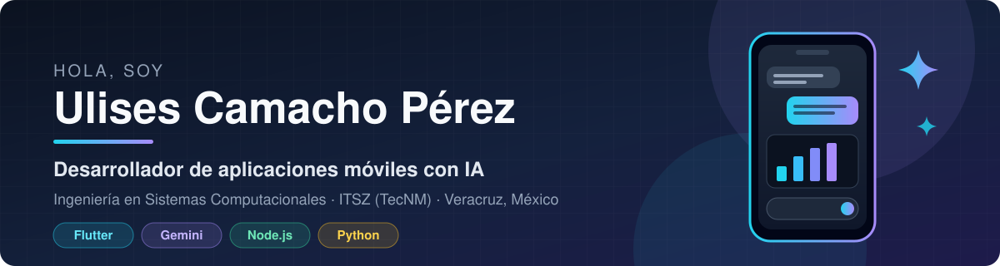
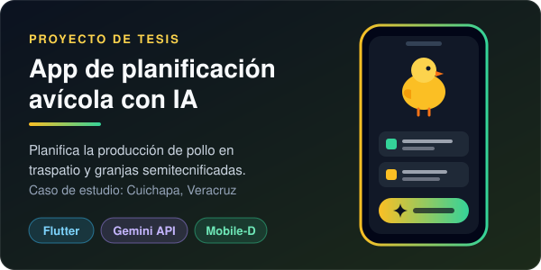
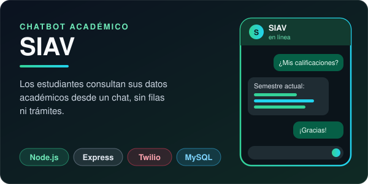
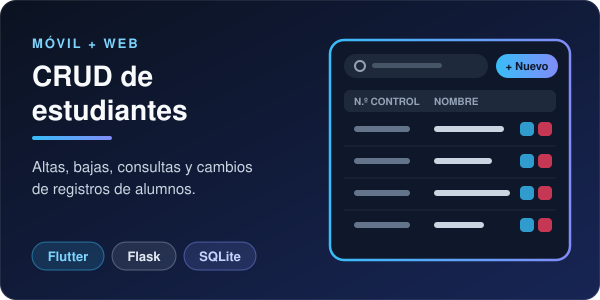

  

  📱 Aplicaciones móviles con IA (Flutter + Gemini) · Backend con Node.js y Flask · Sistemas embebidos con Arduino

---

### 🙋‍♂️ Sobre mí

- 🎓 Estudiante de 9.º semestre de **Ingeniería en Sistemas Computacionales** en el Instituto Tecnológico Superior de Zongolica.
- 🌱 Estoy aprendiendo: **Flutter/Dart, IA generativa (Gemini API), C/C++ para microcontroladores y Git/GitHub**.
- 🚜 Me interesa crear tecnología útil para el campo y la región: producción avícola y servicios para estudiantes.
- 📫 Contacto: **uxamp9769@gmail.com**
- ⚡ Dato curioso: me gusta combinar software y hardware para resolver problemas reales.

---

### 📱 Aplicaciones móviles con IA

Me enfoco en crear **apps móviles multiplataforma (Android/iOS) con inteligencia artificial integrada**:

- 🤖 Integración de **IA generativa (Google Gemini API)** para recomendaciones, asistentes y análisis de datos dentro de la app.
- 📲 Desarrollo con **Flutter y Dart**, con interfaces diseñadas primero en **Figma**.
- 🗄️ Almacenamiento local con **SQLite** y conexión a APIs propias en **Node.js** o **Flask**.
- 🧱 Aprendiendo **Clean Architecture** y la metodología ágil **Mobile-D** para apps móviles.

---

### 🚀 Proyectos

<table>
  <tr>
    <td width="50%"></td>
    <td width="50%"></td>
  </tr>
  <tr>
    <td><b>🐔 App de planificación avícola</b> App móvil con IA para planificar la producción de pollo en traspatio y granjas semitecnificadas (Cuichapa, Ver.). Proyecto de tesis. Flutter · Dart · Gemini API</td>
    <td><b>💬 SIAV – Chatbot académico</b> Chatbot de WhatsApp para que estudiantes consulten sus datos académicos. Node.js · Express · Twilio · MySQL</td>
  </tr>
  <tr>
    <td width="50%"></td>
    <td></td>
  </tr>
  <tr>
    <td><b>📚 CRUD de estudiantes</b> Altas, bajas y cambios de registros de alumnos en móvil y web. Flutter + SQLite · Flask + SQLite</td>
    <td></td>
  </tr>
</table>

---

### 🛠️ Tecnologías y herramientas

**Lenguajes**

**Frameworks y entornos**

**Bases de datos**

**Hardware y herramientas**

---

### 📊 Estadísticas

  
  

---

### 🎯 Metas 2026–2027

- [ ] Publicar en GitHub el código de mis proyectos escolares
- [ ] Terminar mi tesis y residencia profesional
- [ ] Aprender buenas prácticas: ramas, *pull requests* y README por proyecto
- [ ] Contribuir a un proyecto de código abierto

---

⭐ ¡Gracias por visitar mi perfil! ⭐

